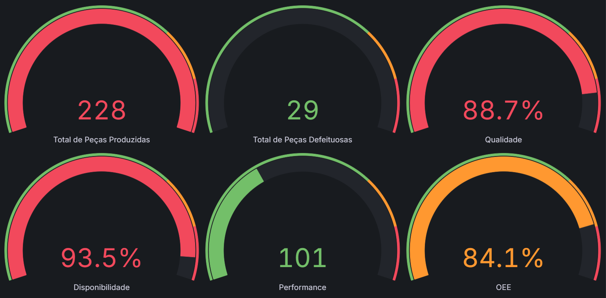

# Solução - Desafio Pipeline de Dados EX-001

## 1. O que o Projeto Faz:
Este projeto captura dados de uma máquina pela internet, salva essas informações em um banco de dados e, por fim, exibe os resultados em um painel de controle (dashboard) interativo.

## 2. Como Foi Feito:
A solução foi construída em três partes principais:

### Parte 1: O Banco de Dados
- Arquivo criado (db/init.sql) para preparar o banco de dados.

- Este arquivo cria a tabela dados_maquina, que é onde todas as informações da máquina são guardadas. A coluna de data e hora foi configurada para evitar problemas com fuso horário e para permitir buscas rápidas.

### Parte 2: Script Python
- Criei um script Python que se conecta à internet para receber os dados da máquina.

- O código foi dividido em arquivos menores (config.py, database.py, mqtt_client.py) para ficar mais limpo e organizado.

- O script fica "ouvindo" um canal específico (o tópico MQTT).

- Sempre que um novo dado da máquina chega, o script o pega e salva imediatamente no banco de dados.

### Parte 3: Construção do Dashboard no Grafana
- Criei um dashboard do zero no Grafana para visualizar os indicadores pedidos.

- Conectei o Grafana ao banco de dados.

- Utilizei diferentes tipos de painéis para representar cada dado da melhor forma:
  - Gauge e Stat para os KPIs principais (OEE, Performance), com cores que mudam de acordo com metas (Thresholds) para um feedback visual imediato.

  - Pie Chart e Bar Gauge para mostrar a proporção entre peças boas e ruins.

  - Time Series (Gráficos de Histórico), o ponto alto do dashboard, para mostrar a evolução da Performance, Disponibilidade e OEE ao longo do tempo. Isso permite uma análise de tendências, não apenas uma foto do momento atual.

- Para cada indicador, escrevi um comando SQL que faz o cálculo necessário (soma de peças, cálculo de porcentagens, etc.).

- O dashboard final foi exportado como um arquivo .json e incluído no provisionamento do Grafana, garantindo que ele seja criado automaticamente sempre que o ambiente for iniciado.

## 3. Como Executar a Solução
Estes foram os comandos usados no terminal para configurar e rodar o projeto.

### 1. Preparar o Ambiente:

Primeiro, copie o arquivo de exemplo para criar sua própria configuração:
```
cp .env.example .env
```

Depois, abra o arquivo .env e preencha com as senhas e configurações necessárias.
```
- MQTT_HOST = mqtt.ecoplus-apps.com
- MQTT_PORT = 1883
- MQTT_USER = ecoplus_temp:user_temp
- MQTT_PASS = u9JJ8d8DOp
```

## 2. Executar o Projeto:
Para ligar todos os programas (banco de dados, script Python e Grafana), use este comando:
```
docker-compose up --build
```

## 3. Acessar o Dashboard:
Após rodar o comando acima, o painel de controle estará disponível no seu navegador no seguinte endereço:
```http://localhost:3000``` (usuário: admin, senha: admin)

## 4. O Resultado Final
### 4.1. Dashboard
O resultado é um painel de controle que mostra os dados da máquina em tempo real.



#### O arquivo que contém o design completo deste dashboard está salvo em:
```grafana/provisioning/dashboards/dashboard_oee.json```
